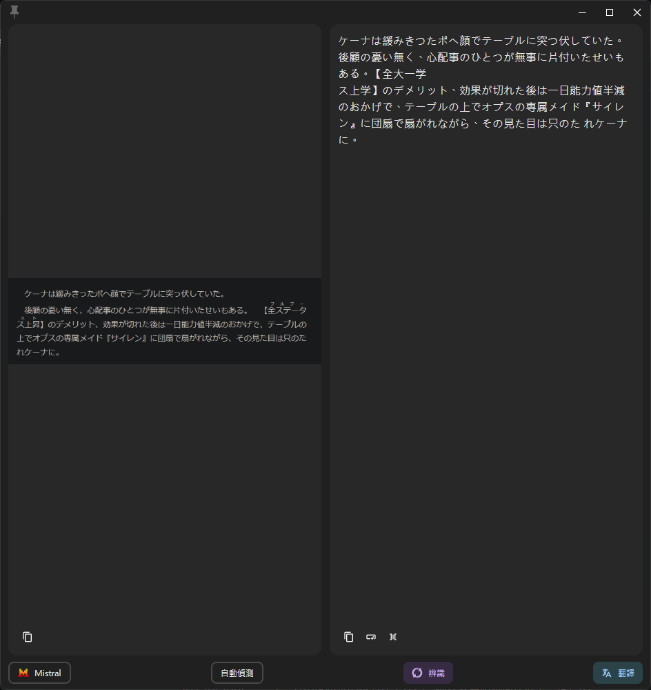
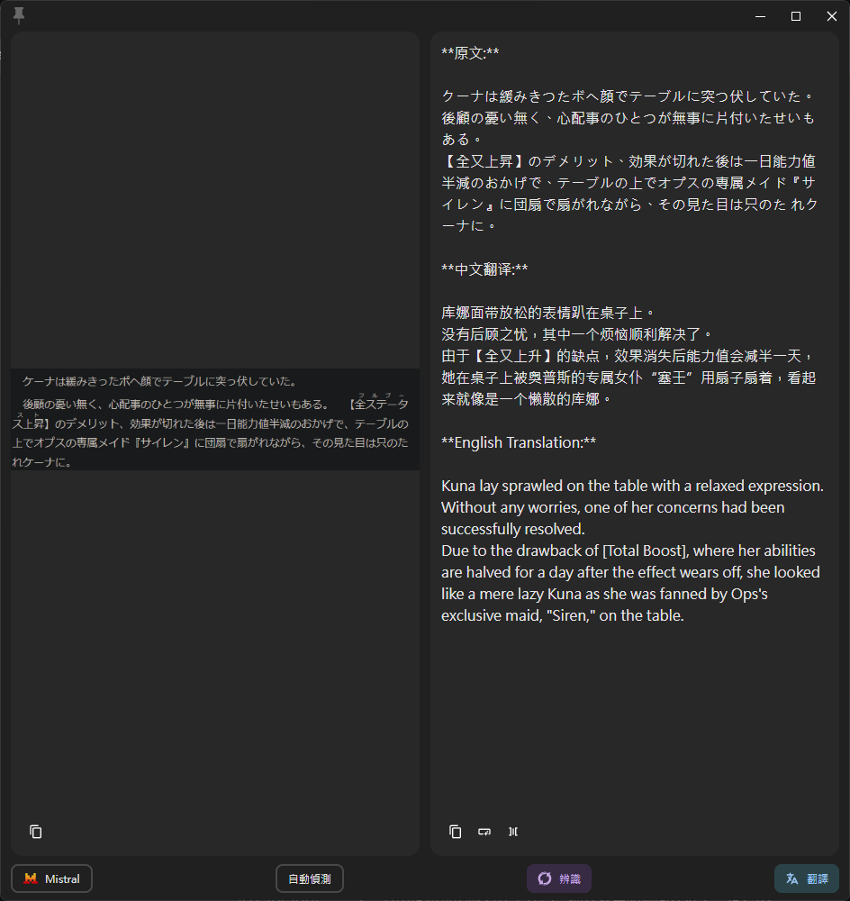

# Pot-App Mistral 文字識別插件

[中文](README.md) | [English](README_EN.md)

這是一個 [pot-app](https://github.com/pot-app/pot-app) 的 Mistral AI OCR 識別外掛，支援多種 LLM 進行後處理。

## 支援功能

- [x] 文字辨識 (OCR，使用 Mistral AI)
- [x] 文字後處理 (支援 OpenAI、Google Gemini 或 Mistral AI)

## 功能展示

### OCR 文字識別

使用的 Prompt：`Just recognize the text in the image. Do not offer unnecessary explanations.`

### LLM 文字後處理

使用的 Prompt：`保留原文，並另外翻譯一份中文跟英文`

## 使用方法

### 配置

#### 基本 OCR 設定

使用前請先在插件配置處填入 Mistral AI 的 API Key

1. 登入 [Mistral AI 官網](https://mistral.ai/)
2. 前往 [API Keys](https://console.mistral.ai/api-keys/) 頁面
3. 創建新的 API Key
4. 將創建好的 API Key 填入外掛配置中的「API Key」欄位

#### 文字後處理設定 (LLM)

此外掛支援使用 LLM 對 OCR 結果進行後處理，可以分析、整理文字內容，支援多種 LLM 服務提供者。

1. 啟用文字後處理：選擇「啟用」
2. LLM 模型：填入要使用的模型
   - OpenAI: `gpt-4o`、`gpt-4-mini` 等
   - Gemini: `gemini-2.0-flash`、`gemini-1.5-pro` 等
   - Mistral: `mistral-large-latest`、`mistral-medium` 等

3. LLM API Key：填入對應 LLM 服務的 API Key
   - 若留空，將預設使用與 OCR 相同的 API Key (僅 Mistral 可以共用)

4. LLM API 路徑：設定 API 請求路徑
   - OpenAI: 可簡化輸入為 `https://api.openai.com`（系統會自動補齊完整路徑）
   - Gemini: 留空即可，系統會根據選擇的模型自動生成
   - Mistral: 可簡化輸入為 `https://api.mistral.ai`（系統會自動補齊完整路徑）
   - 第三方 OpenAI 兼容服務: 輸入 API 基礎地址即可（如 `https://xxx.com`）

5. 自定義 Prompt：可自定義指示 LLM 如何處理 OCR 文本的提示詞
   - 可使用 `$lang` 變數來代表當前識別的語言
   - 例如：`請用$lang分析並整理以下文字，找出重點：`

## 使用案例

1. **純 OCR 文字辨識**：
   - 關閉「啟用文字後處理」選項
   - 直接獲取圖片中的原始文字

2. **使用 OpenAI 進行智能文字分析**：
   - 選擇 LLM 提供者為 OpenAI
   - 填入您的 OpenAI API Key
   - 設定合適的 Prompt，例如「請分析這段文字並提取關鍵信息」
   - GPT 模型會對 OCR 辨識出的文字進行分析處理

3. **使用 Google Gemini 進行文本格式化**：
   - 選擇 LLM 提供者為 Google Gemini
   - 填入您的 Google API Key
   - 使用 Prompt 如「請將這段文字整理成條列式清單」
   - 獲得 Gemini 模型格式化後的文本內容

4. **使用 Mistral AI 進行文本翻譯**：
   - 選擇 LLM 提供者為 Mistral AI
   - 使用與 OCR 相同的 API Key 或填入專用的 Key
   - 使用 Prompt 如「請將此文本翻譯成$lang」
   - 獲得 Mistral 模型翻譯後的內容