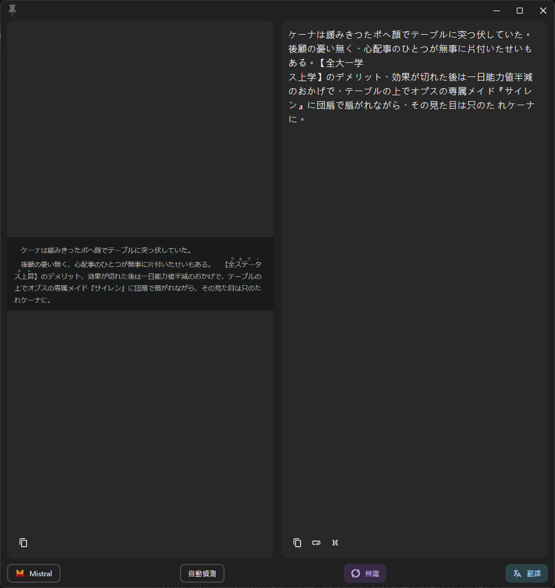
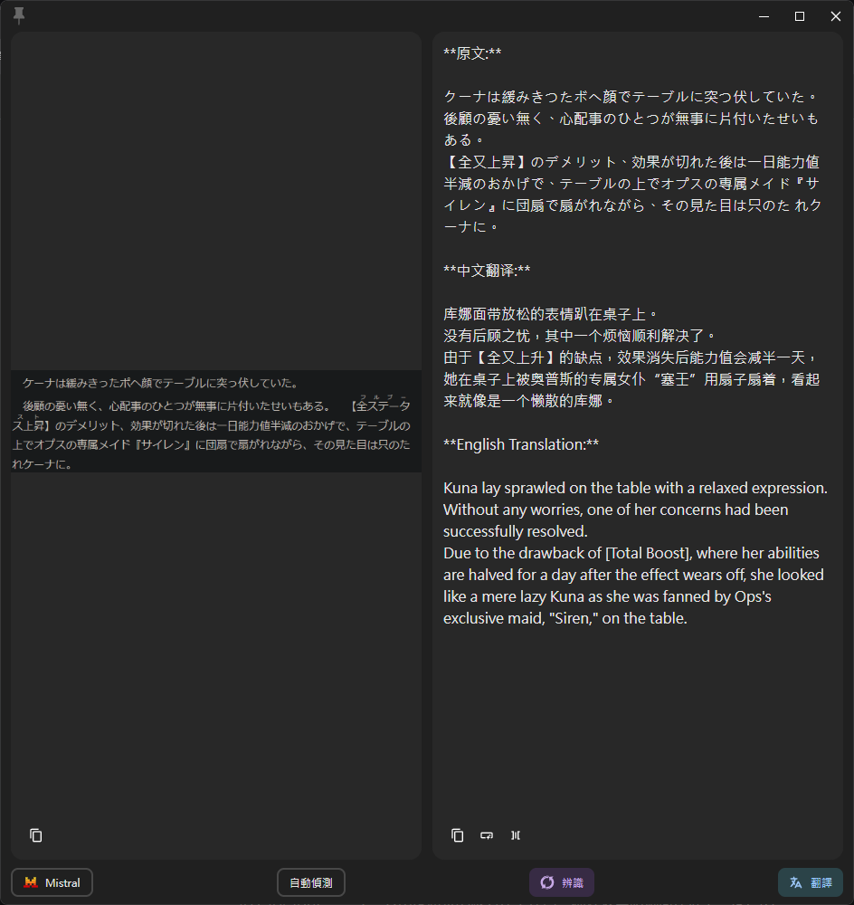

# Pot-App Mistral Text Recognition Plugin

[中文](README.md) | English

This is a Mistral AI OCR recognition plugin for [pot-app](https://github.com/pot-app/pot-app), supporting multiple LLM providers for text post-processing.

## Features

- [x] Text Recognition (OCR, using Mistral AI)
- [x] Text Post-processing (supporting OpenAI, Google Gemini, or Mistral AI)

## Demo

### OCR Text Recognition

Prompt used: `Just recognize the text in the image. Do not offer unnecessary explanations.`

### LLM Text Post-processing

Prompt used: `Preserve the original text, and provide translations in both Chinese and English`

## Usage

### Installation

### Configuration

#### Basic OCR Settings

Please fill in your Mistral AI API Key in the plugin configuration before use.

1. Log in to [Mistral AI](https://mistral.ai/)
2. Go to the [API Keys](https://console.mistral.ai/api-keys/) page
3. Create a new API Key
4. Enter the API Key in the "API Key" field in the plugin configuration

#### Text Post-processing Settings (LLM)

This plugin supports using LLM to post-process OCR results, analyzing and organizing text content, with support for multiple LLM service providers.

1. Enable text post-processing: Select "Enable"
2. LLM Model: Enter the model you want to use
   - OpenAI: `gpt-4o`, `gpt-4o-mini`, etc.
   - Gemini: `gemini-2.0-flash`, `gemini-1.5-pro`, etc.
   - Mistral: `mistral-large-latest`, `mistral-medium`, etc.

3. LLM API Key: Enter the API Key for the corresponding LLM service
   - If left empty, the plugin will use the same API Key as OCR (only works with Mistral)

4. LLM API Path: Set the API request path
   - OpenAI: Can be simplified to `https://api.openai.com` (system will auto-complete the full path)
   - Gemini: Leave empty, system will auto-generate based on the selected model
   - Mistral: Can be simplified to `https://api.mistral.ai` (system will auto-complete the full path)
   - Third-party OpenAI-compatible services: Enter the base API address (e.g., `https://xxx.com`)

5. Custom Prompt: Customize instructions for the LLM on how to process the OCR text
   - You can use the `$lang` variable to represent the current recognition language
   - For example: `Please analyze and organize the following text in $lang, identifying key points:`

## Use Cases

1. **Pure OCR Text Recognition**:
   - Turn off "Enable text post-processing" option
   - Get the original text from the image directly

2. **Intelligent Text Analysis with OpenAI**:
   - Select OpenAI as the LLM provider
   - Enter your OpenAI API Key
   - Set an appropriate prompt, e.g., "Please analyze this text and extract key information"
   - The GPT model will analyze and process the text recognized by OCR

3. **Text Formatting with Google Gemini**:
   - Select Google Gemini as the LLM provider
   - Enter your Google API Key
   - Use a prompt like "Please format this text as a bulleted list"
   - Get formatted text content from the Gemini model

4. **Text Translation with Mistral AI**:
   - Select Mistral AI as the LLM provider
   - Use the same API Key as OCR or enter a dedicated key
   - Use a prompt like "Please translate this text to $lang"
   - Get translated content from the Mistral model